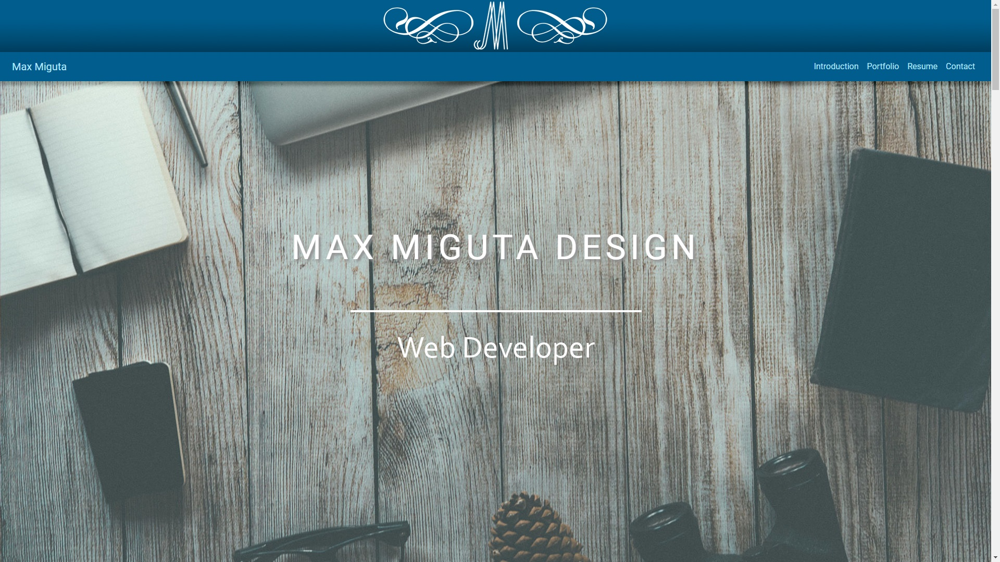

# Personal Portfolio website



## Overview

### What is this website for?

This website is designed to inform any potential employers or clients of my key skills as well as my employment history and to showcase the web projects I've created so far. Its function is to effectively act as a comprehensive online CV.

### What does it do?

The website offers users all the relevant information about me as a web developer and provides links to examples of my work. It also allows any potential employers or clients to get in touch with me via a contact form.

## Demo

You can see the live website [here](https://www.maxmiguta.com/).

## Features

- Responsive design ensures the website will display well on any screen size
- Parallax effect used on background images to improve user experience
- Contact form (with full validation) is linked to EmailJS to facilitate distribution of user messages to a specified email address

## Technologies used

- HTML5
- CSS3
- JavaScript
- Bootstrap
- Flexbox
- EmailJS
- Font Awesome

## Testing

### Responsive testing

I tested my website in the following browsers:
```
Mozilla Firefox
Google Chrome
Internet Explorer
Safari
```
The website looks good and works fine at full screen size on all of the above.

In order to test how the site looks on smaller screens I used the developer tools in Google Chrome and Firefox to simulate browsing on various devices, as well as my own Android phone and iPad. My website passes all of those tests.